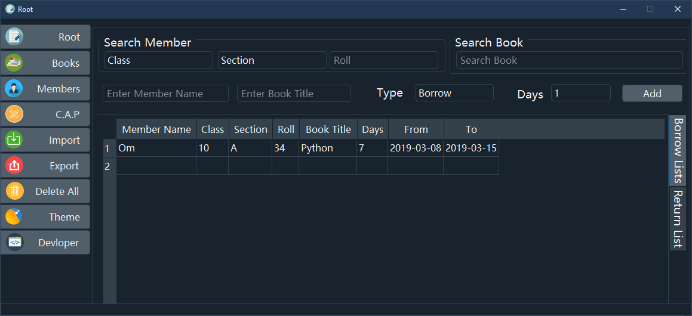
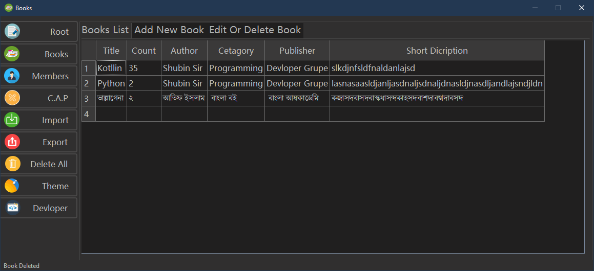

# Library-System
A Library System Project You can use it to own library to make work easy 

## Freatures
* Members
  * Add Library Member
  * Delete Members
  * Edit Members
  * Search Members
* Books
  * Add Library Books
  * Delete Books
  * Edit Books
  * Search Books
* Cetagorys
  * Add Book Cetagorys
  * Delete Book Cetagorys
* Author
  * Add Book Author
  * Delete Book Author
* Publisher
  * Add Book Publisher
  * Delete Book Publisher
* Add Books which is borrowed by a particular member from a particular date for a particular day
* Add Books and return date which is returned by that member who borrowed that book
* Import Data from csv file into database
* Export Data from database as (csv,xlsx,json)
* Delete all databses data in one click
* Added 2 Themes
  * Dark_Blue
     
  * Dark
     

## Installation requirement
> pip3 install -r requirement.txt

# Hope You Like!!!!
## Then hit a small touch on star which is appreciate me
# Thank You For Visiting
